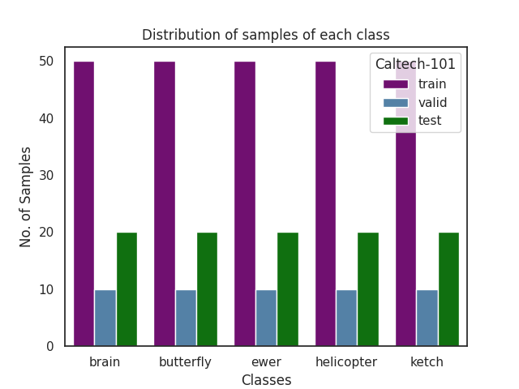
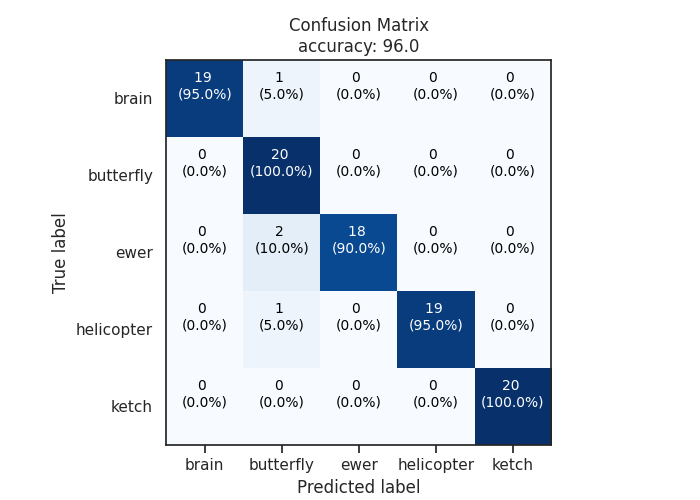
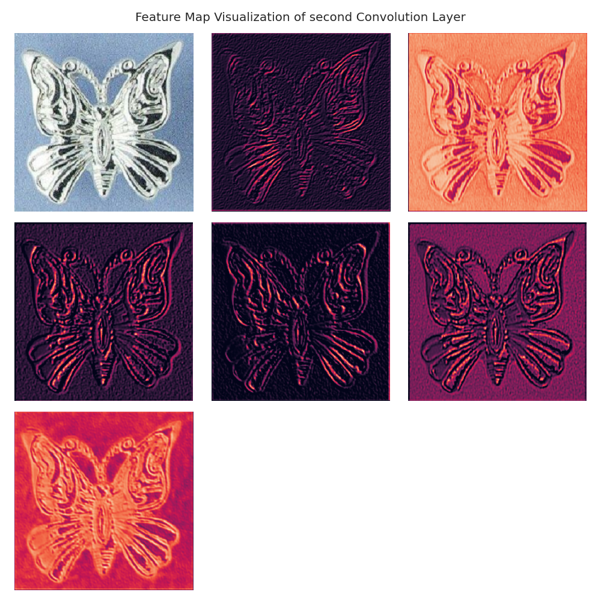
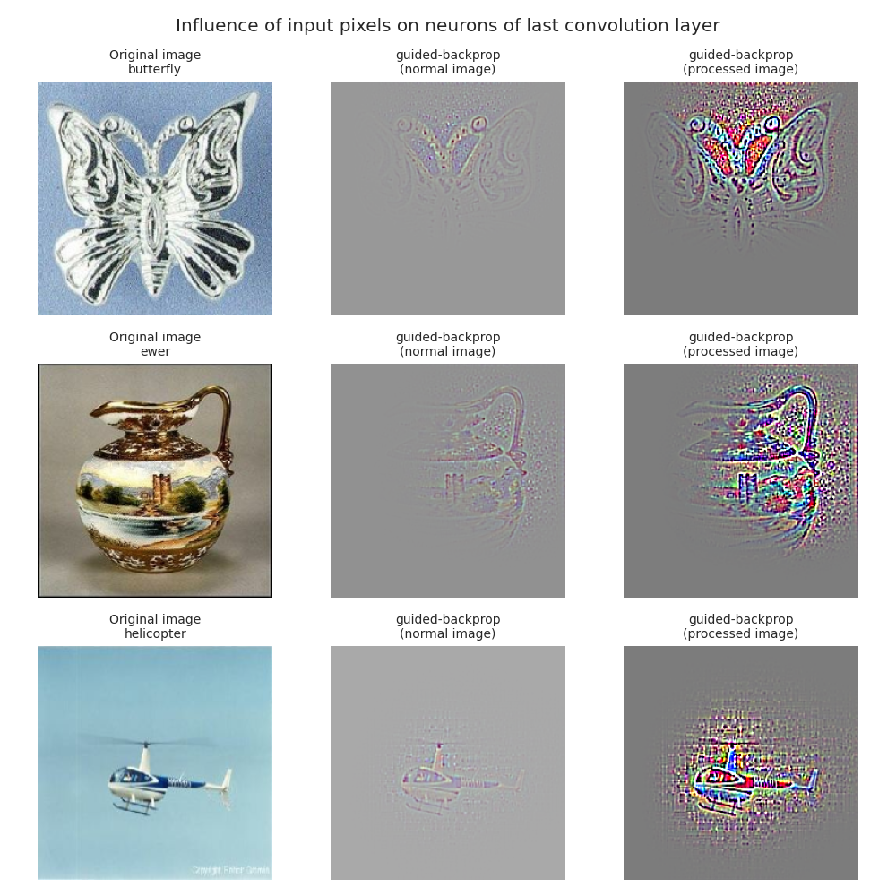
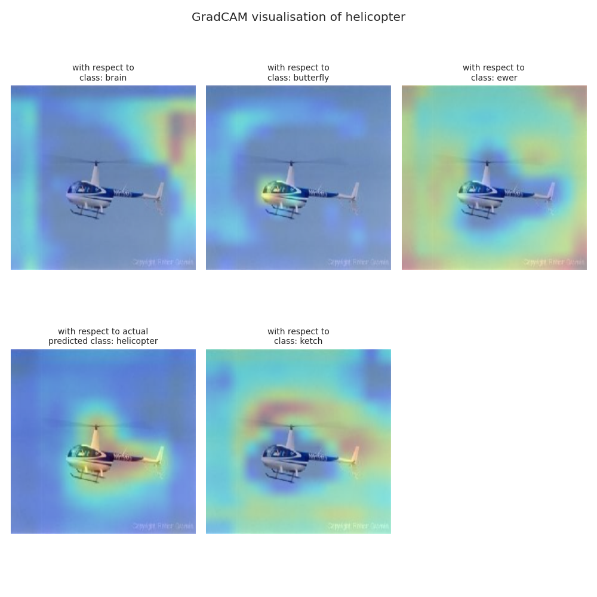
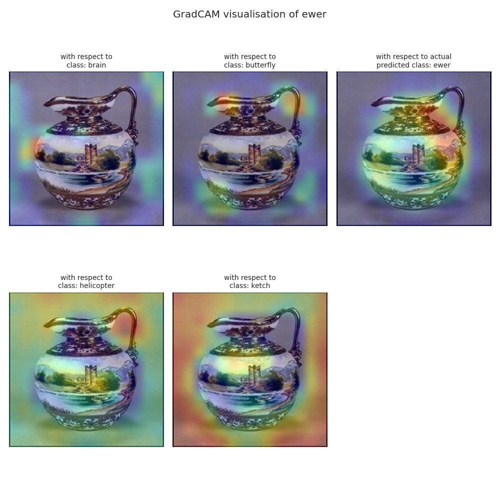

# Visualization of CNN (with Transfer Learning, VGG19) [](https://github.com/Narayan1281/Image-Classification-with-CNN-and-Visualization/blob/main/LICENSE)

[](https://githubtocolab.com/Narayan1281/Image-Classification-with-CNN-and-Visualization/blob/main/CNN-visualization-with-transfer-learning.ipynb "Open Notebook") 

<a href="https://www.kaggle.com/code/narayan1281/transfer-learning-and-visualization-of-cnn-layers" target="_blank"></a><br>


In this project, we'll be performing ```Transfer Learning``` on a subset of Caltech-101 dataset using VGG19 and then visualize influence of some of the input pixels on last convolution layer neurons using guided-backpropagation and GradCAM algorithms. Receptive field and feature map visualization would also be done as part of this project.

## About Dataset:

The dataset contains images from five classes namely ```brain```, ```butterfly```, ```ewer```, ```helicopter``` and ```ketch```. Their distribution in the training, validation and test is as follows:



## Results and Discussion:

- **Accuracies of the model trained using transfer learning:** 

    ```
    +---------------+----------------+--------+
    | Caltech-101   |  Accuracy (%)  |  loss  |
    +===============+================+========+
    | train         |      100       | 0.016  |
    +---------------+----------------+--------+
    | valid         |       98       | 0.071  |
    +---------------+----------------+--------+
    | test          |       96       | 0.112  |
    +---------------+----------------+--------+
    ```

- **Confusion Matrix Plot (on test data):**

    

    From above confusion matrix plotted on test dataset we can observe that our model has a very good generalization ability despite trained on less number of training samples. This is the advantage of **Transfer Learning**, where we make use of pre-trained model in order to perform classification task.

- **Feature Map (output of second convolution layer):**
   
    

    - Original image along with the feature maps has been plotted above. 
  
    - From the output of neurons in second convolution layer we can see that the intial convolution layer learns the **local information** present in the input image. Different feature map tries to learn different representations of input image.

- **Receptive Field:**
  
    Tracing back to the patch in the image which causes convolution neurons present in the last convolution layer to maximally fire. This calculation has been done mathematically using padding, stride and kernel size information provided by tensorflow (alternatively, it could be calculated using gradient).

    .png "receptive field patches")

    - These patches indicates the portion of the input images where the maximally activated neuron in the last convolution layer looks to get the abstract representation of original input.

    - One important thing to notice is that all the patches are of same size, due to padding some of the portion of the rectangle is outside the original image and hence ignored.
  
- **Guided Backpropagation Algorithm (to visualize influence of input pixels):**
    
    It is a heuristic based algorithm for finding the influence of input on the output of the selected neuron of last convolution layer.

    It does not considers the influence of negative gradients as well as the gradients associated with -ve activation values during backpropagation step i.e., it sets these values to zero.

    

    - We can see that the last convolution layer neurons tries to learn one of the feature present in the input pixels, i.e. antennae and some portion of wings of butterfly, handle of ewer etc.

    - In case of image of helicopter, the output neuron of interest depends only on the relevent features.

- **Visualization of localization map (heat map) using GradCAM Algorithm**
    
    In each of the following images, we'll observe the ```heat map``` that highlights the important regions in that image for predicting its class and other classes.

    
    Case (i):

    

    Case (ii):

    

    - After looking carefully at all the plots of gradCAM heat map on above images with respect to all the 5 classes, we observed that ```specific classes focus on specific pixels/features that influences predicted output```.
  

    - If this gradient calculated on predicted class w.r.t to the output of last convolution layer,  then the position of the heatmap is the ```determining feature``` or most important portion of image from classification point of view.
  
## Conclusion:

- The above visualizations help us to understand ```how the CNN arrived at its prediction```, which can be useful for debugging the model or improving its performance.

- The guided backpropagation technique is used to identify the input features that contribute most to the output of the CNN. It is a heuristic based algorithm however it works exceptionally.

## Future Aspects:

- Visualization using ```Guided GradCAM (I & II) algorithm```.

- Finding Influence of Input Pixels using ```Deconvnet``` (on a lighter note, This gives the better picture of influence than simple backpropagation. However, this procedure does not show very sharp influences).

## Refrences:

- [stackoverflow refrence : Transfer Learning](https://stackoverflow.com/questions/60623869/gradcam-with-guided-backprop-for-transfer-learning-in-tensorflow-2-0 "Transfer Learning with functional API")
